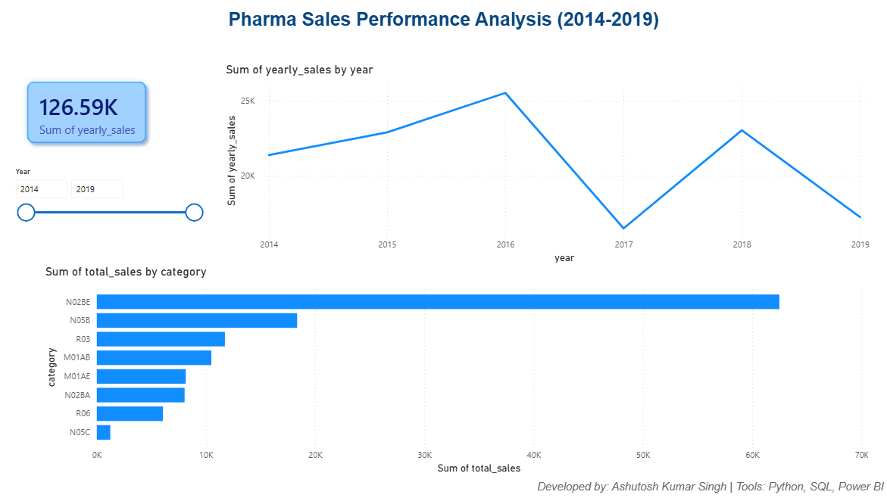
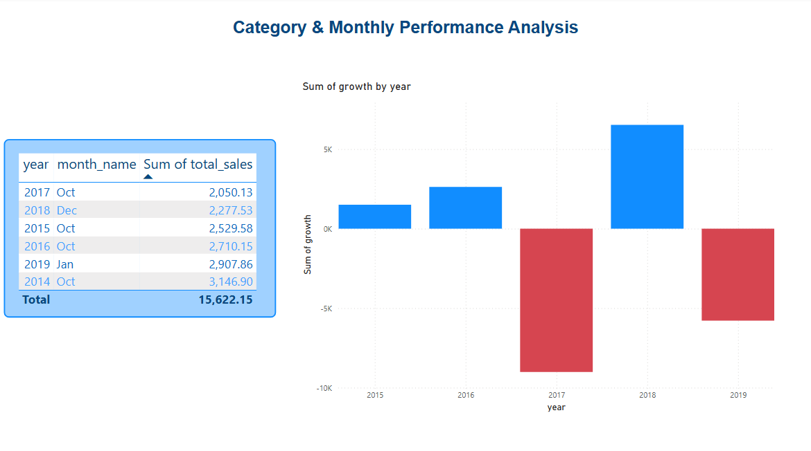
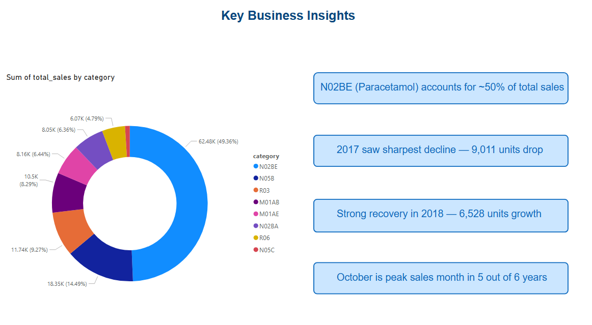

# Pharma Sales Analytics Dashboard

## Project Overview
End-to-end data analytics project analyzing 6 years of pharmaceutical sales data across 8 drug categories using Python, SQL and Power BI.

## Tools & Technologies
- **Python (Pandas)** — Data cleaning and transformation
- **SQL (SQLite)** — Data analysis and business queries
- **Power BI** — Interactive dashboard and visualization

## Dataset
- **Source:** Kaggle — Pharma Sales Dataset
- **Period:** 2014 to 2019 (6 years)
- **Volume:** 70 monthly records across 8 ATC drug categories

## Drug Categories Analyzed
| Code | Drug Type |
|------|-----------|
| N02BE | Analgesics — Paracetamol (highest selling) |
| N05B | Anxiolytics |
| R03 | Respiratory drugs |
| M01AB | Anti-inflammatory |
| M01AE | Anti-inflammatory |
| N02BA | Analgesics — Aspirin |
| R06 | Antihistamines |
| N05C | Hypnotics and Sedatives |

## What I Did
1. **Data Cleaning** — Loaded raw CSV, converted date formats, extracted year/month, calculated total sales per month
2. **SQL Analysis** — Wrote 4 queries: yearly sales trends, category ranking, best month per year, year over year growth
3. **Power BI Dashboard** — Built 3-page interactive dashboard connected to cleaned CSV files with slicers, trend charts and category analysis
   
## Dashboard Pages
- **Page 1 — Sales Overview:** Total sales card, yearly trend line chart, sales by category bar chart, year slicer
- **Page 2 — Category Analysis:** Best month per year table, year over year growth chart (positive/negative bars)
- **Page 3 — Key Insights:** Category share donut chart, 4 business insight cards

## Key Business Insights
1. **N02BE (Paracetamol) dominates** — accounts for ~50% of total sales across all 6 years
2. **October is consistently peak month** — appears as best sales month in 5 out of 6 years, driven by cold/flu season
3. **2017 saw sharpest decline** — sales dropped 9,011 units, the largest year over year decline in the dataset
4. **Strong 2018 recovery** — sales grew 6,528 units, suggesting 2017 decline was a temporary disruption

## Dashboard Screenshots
### Sales Overview

### Category Analysis

### Key Insights

## Project Structure
pharma_analytics/
├── clean_data.py              # Data cleaning script
├── analysis.py                # SQL analysis queries
├── salesmonthly_cleaned.csv   # Cleaned dataset
├── yearly_sales.csv           # Yearly sales output
├── category_sales.csv         # Category ranking output
├── best_month.csv             # Best month per year output
├── yoy_growth.csv             # Year over year growth output
├── Sales_Overview.png         # Dashboard screenshot
├── Category_Analysis.png      # Dashboard screenshot
└── Insights.png               # Dashboard screenshot

## Author
**Ashutosh Kumar Singh**
- LinkedIn: linkedin.com/in/ashuks
- Email: Singhashu1339@gmail.com
